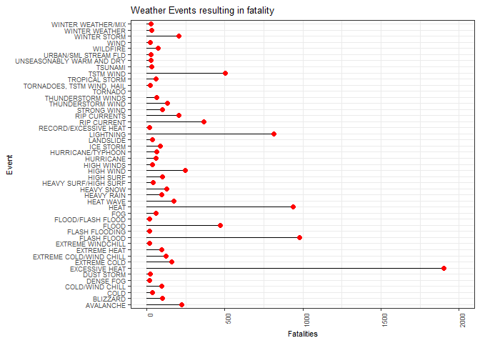
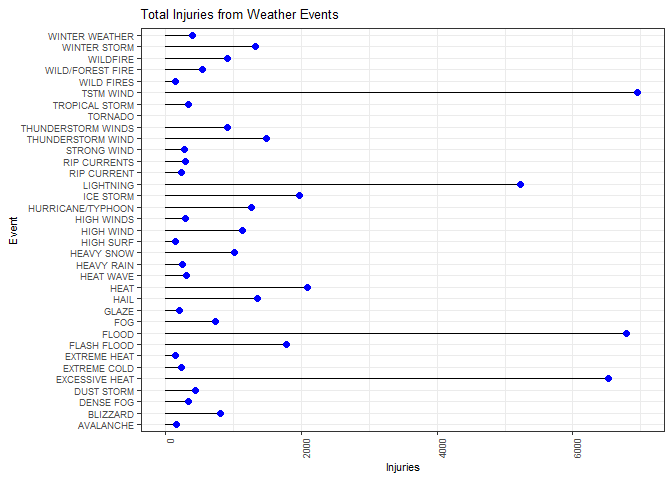
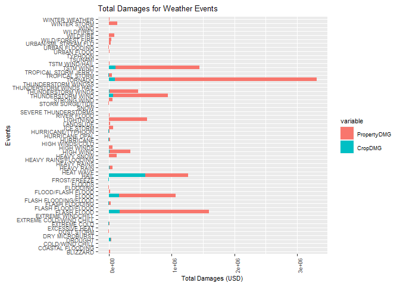

synopsis
========

In this analysis we look at the NOAA Storm Database to answer 2
questions. Which type of weather events are most harmful to human
health, and which cause the most economic damage. From the data we find
that Tornadoes cause the most overall damage in both respects. Other
harmful and damaging types of weather events include: flood, heat, wind,
hail and lightning. To arrive at these results we plot total fatalities,
injuries, property damage and crop damage for each weather event with
significantly high observations.

Data Processing
===============

Load in required packages.

    library(ggplot2)
    library(reshape2)
    library(dplyr)

Download the dataset, if statement is used to prevent from unnecessarily
downloading.

    filename <- "storm_data.csv"
    if(!file.exists(filename)){download.file("https://d396qusza40orc.cloudfront.net/repdata%2Fdata%2FStormData.csv.bz2","storm_data.csv")}

We read in the data.

    stormData <- read.csv("storm_data.csv",na.strings = "")

Results
=======

Which Weather Events Are Most Harmful To Human Health?
------------------------------------------------------

To answer this question we are interested in variables indicating number
of fatalities and injuries. We check The number of missing values in
each.

    colSums(sapply(stormData[,c("FATALITIES","INJURIES")],is.na))

    ## FATALITIES   INJURIES 
    ##          0          0

We subset the data by any observations that have at least 1 fatality or
at least 1 injury. This removes a lot of data that is not having an
impact on human health.

    harmful_stormData <- subset(stormData,stormData$FATALITIES!=0 | stormData$INJURIES!=0)

To make a plot our first plot we need to total all the fatalities by
each weather event. From the summary we see that the data has a positive
skew.

    totalFatal <- tapply(harmful_stormData$FATALITIES,harmful_stormData$EVTYPE,sum)
    summary(totalFatal)

    ##    Min. 1st Qu.  Median    Mean 3rd Qu.    Max. 
    ##    0.00    1.00    2.00   68.84   10.25 5633.00

To account for this we subset the list of total fatalities by including
events which account for more than 0.1 % of all fatalities.To do this
first calculate the each of the total fatalities as a percentage, this
shows what percentage of total fatalities each weather event makes up
for.

    percentFatal <- 100*totalFatal/sum(totalFatal)
    head(percentFatal,15)

    ##                 AVALANCE                AVALANCHE                BLACK ICE                 BLIZZARD             blowing snow             BLOWING SNOW 
    ##              0.006602839              1.479035985              0.006602839              0.666886761              0.006602839              0.006602839 
    ##               BRUSH FIRE            COASTAL FLOOD         Coastal Flooding         COASTAL FLOODING COASTAL FLOODING/EROSION            Coastal Storm 
    ##              0.000000000              0.019808518              0.013205678              0.006602839              0.000000000              0.000000000 
    ##            COASTAL STORM             COASTALSTORM                     Cold 
    ##              0.019808518              0.006602839              0.019808518

Just from the first 15 events we can see there are many weather events
that account for a very small amount of the total fatalities, we will
remove these as they will make the plot difficult to read and are not as
relevant as weather events that make up for larger percentages of total
fatalities. We choose a threshold of 0.1% as this leaves over 97% of all
fatalities left in the data but removes a lot of weather events.

    MajorityFatal_index<- percentFatal[which(percentFatal>0.1)]
    sum(MajorityFatal_index)

    ## [1] 97.28623

    totalFatal <- totalFatal[which(percentFatal>0.1)]

Now we have the weather events we are interested in we put them into a
dataframe.

    df_fatal <- data.frame(Event = names(totalFatal),Fatalities=totalFatal)

Before plotting we take a look at our data in descending order of total
number of fatalities and see that Tornadoes are by far and away the
biggest contributor. For purposes of readability we don’t include
Tornadoes in our plot.

    head(arrange(df_fatal,desc(Fatalities)))

    ##            Event Fatalities
    ## 1        TORNADO       5633
    ## 2 EXCESSIVE HEAT       1903
    ## 3    FLASH FLOOD        978
    ## 4           HEAT        937
    ## 5      LIGHTNING        816
    ## 6      TSTM WIND        504

We make our plot excluding Tornadoes. We see that the events that cause
the most fatalities are excessive heat/heat, flash flood/flood,
lightning and TSTM winds.

    df_fatal %>% ggplot(aes(x=Event,y=Fatalities))+geom_segment(aes(xend=Event,yend=0))+geom_point(size=2,color="red")+coord_flip()+theme_bw()+xlab("Event")+ggtitle("Weather Events resulting in fatality") +ylim(c(0,2000))+theme(text = element_text(size=8),
            axis.text.x = element_text(angle=90, hjust=1))

    ## Warning: Removed 1 rows containing missing values (geom_segment).

    ## Warning: Removed 1 rows containing missing values (geom_point).

We repeat the same process to get results on total number of injuries,
as we can see there is a similar positive skew.

    totalInjur <- tapply(harmful_stormData$INJURIES,harmful_stormData$EVTYPE,sum)
    summary(totalInjur)

    ##     Min.  1st Qu.   Median     Mean  3rd Qu.     Max. 
    ##     0.00     0.00     2.00   638.76    35.25 91346.00

    percentInjur <- 100*totalInjur/sum(totalInjur)
    print(head(percentInjur,15))

    ##                 AVALANCE                AVALANCHE                BLACK ICE                 BLIZZARD             blowing snow             BLOWING SNOW 
    ##              0.000000000              0.120972333              0.017078447              0.572839576              0.000711602              0.009250825 
    ##               BRUSH FIRE            COASTAL FLOOD         Coastal Flooding         COASTAL FLOODING COASTAL FLOODING/EROSION            Coastal Storm 
    ##              0.001423204              0.001423204              0.000000000              0.000000000              0.003558010              0.000711602 
    ##            COASTAL STORM             COASTALSTORM                     Cold 
    ##              0.000711602              0.000000000              0.000000000

This time our subset accounts for over 98% of all injuires.

    MajorityInjur_index<- percentInjur[which(percentInjur>0.1)]
    sum(MajorityInjur_index)

    ## [1] 98.53552

    totalInjur <- totalInjur[which(percentInjur>0.1)]

We create our dataframe in the same way.

    df_injur <- data.frame(Event = names(totalInjur),Injuries=totalInjur)

We see again Tornadoes cause the most injuries

    head(arrange(df_injur,desc(Injuries)))

    ##            Event Injuries
    ## 1        TORNADO    91346
    ## 2      TSTM WIND     6957
    ## 3          FLOOD     6789
    ## 4 EXCESSIVE HEAT     6525
    ## 5      LIGHTNING     5230
    ## 6           HEAT     2100

Plot excluding Tornadoes. Events causing the most injury are Excessive
heat, flood, lightning and TSTM wind.

    df_injur %>% ggplot(aes(x=Event,y=Injuries))+geom_segment(aes(xend=Event,yend=0))+geom_point(size=2,color="blue")+coord_flip()+theme_bw()+xlab("Event")+ggtitle("Total Injuries from Weather Events") +ylim(c(0,7000))+theme(text = element_text(size=8), axis.text.x = element_text(angle=90, hjust=1))

    ## Warning: Removed 1 rows containing missing values (geom_segment).

    ## Warning: Removed 1 rows containing missing values (geom_point).

Lastly we want to include information about these events that was lost
when we subset the original dataset. We now know how many total injuries
and deaths were caused by these most harmful types of weather events,
however if a certain weather event is far more common than another this
could be why the total injuries/fatalities are much higher. To
investigate this first create a dataframe with both the dataframes used
for our plots. We then subset this dataframe to only include events in
which the total fatalities and total injuries sum to more than the sum
of the third quartiles of the respective variables. We call these the
worst events.

    mrg <- merge(df_fatal,df_injur,by="Event")
    WorstEvents <- subset(mrg,mrg$Fatalities+mrg$Injuries>(quantile(mrg$Fatalities)[[4]]+quantile(mrg$Injuries)[[4]]))$Event
    print(WorstEvents)

    ## [1] "EXCESSIVE HEAT" "FLASH FLOOD"    "FLOOD"          "HEAT"           "ICE STORM"      "LIGHTNING"      "TORNADO"        "TSTM WIND"

Now we count all the total observations of our worst events that results
in fatality or injury.

    No.harmfulEvents<- sapply(split(harmful_stormData,harmful_stormData$EVTYPE),nrow)[WorstEvents]

And count all worst events recorded

    No.Events<-sapply(split(stormData,stormData$EVTYPE),nrow)[WorstEvents]

Now we have the percent of our worst events that resulted in a fatality
or injury.

    (No.harmfulEvents/No.Events)*100

    ## EXCESSIVE HEAT    FLASH FLOOD          FLOOD           HEAT      ICE STORM      LIGHTNING        TORNADO      TSTM WIND 
    ##      40.405244       1.715275       1.618890      27.249022       4.735793      20.978799      13.071292       1.332182

This is useful as we can see while Tornadoes overall have caused the
most harmful outcomes to human health, a smaller percent of them result
in death/injury. As we can see it takes far less events of excessive
heat and lightning to result in more injury or death.

Which Types Of Events Have The Greatest Economic Consequences?
--------------------------------------------------------------

To answer this question we are interested in variables indicating
Property damage and crop damage. We check The number of missing values
in each.

    colSums(sapply(stormData[,c("PROPDMG","CROPDMG")],is.na))

    ## PROPDMG CROPDMG 
    ##       0       0

We then subset the data to include property damage of at least 1 or crop
damage of at least 1 (units of USD). Also we select only variables we
are interested in.

    ecoDmg_data <- subset(stormData,stormData$PROPDMG!=0 | stormData$CROPDMG!=0)
    ecoDmg_data <- select(ecoDmg_data,"EVTYPE","PROPDMG","CROPDMG")

We calculate the total Property damage by weather see that there is a
large positive skew

    TotalPropDmg <- tapply(ecoDmg_data$PROPDMG,ecoDmg_data$EVTYPE,sum)
    summary(TotalPropDmg)

    ##    Min. 1st Qu.  Median    Mean 3rd Qu.    Max. 
    ##       0       5      50   25254     501 3212258

We subset the Total property damage by taking only the top 25% of the
data as we are only interested in the events causing the most economic
damage.

    ThresholdDmg <- which(TotalPropDmg>quantile(TotalPropDmg)[[4]])
    TotalPropDmg <- TotalPropDmg[ThresholdDmg]

We do the same for crop damage.

    TotalCropDmg <- tapply(ecoDmg_data$CROPDMG,ecoDmg_data$EVTYPE,sum)
    summary(TotalCropDmg)

    ##     Min.  1st Qu.   Median     Mean  3rd Qu.     Max. 
    ##      0.0      0.0      0.0   3196.8      8.6 579596.3

    ThresholdDmg_crop <- which(TotalCropDmg>quantile(TotalCropDmg)[[4]])
    TotalCropDmg <- TotalCropDmg[ThresholdDmg_crop]

We take the intersection of the top 25% of the total damage each case
and create a dataframe with only events from this intersection.

    both <- intersect(names(TotalCropDmg),names(TotalPropDmg))
    ecoDmg_data <- data.frame(Events = both,PropertyDMG = TotalPropDmg[both],CropDMG=TotalCropDmg[both])

We melt the data into a tall skinny dataframe with in preparation for a
faceted plot.

    ecoPlot_data<- melt(ecoDmg_data,id=c("Events"))

Plot the total damages with respect to property and crop.

    ggplot(ecoPlot_data,aes(fill=variable,x=Events,y=value))+geom_bar(position = "stack",stat = "identity") +coord_flip() + ylab("Total Damages (USD)") + ggtitle("Total Damages for Weather Events") +theme(text = element_text(size=8), axis.text.x = element_text(angle=90, hjust=1))

We see that Tornado, flood and TSTM winds are all big contributors as
when investigating impact on human health. Hail is an event that causes
economic damge but not as much damage to health.
